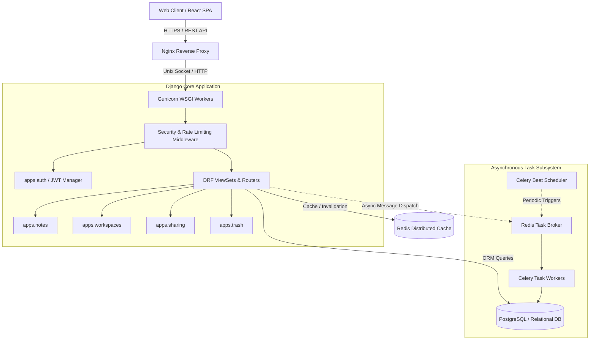

# Scriba Backend Engine ⚙️

> **Enterprise-grade RESTful API, asynchronous task queue, and data management layer powering Scriba.**

[](https://scriba-notes.duckdns.org)
[](https://www.python.org/)
[](https://www.djangoproject.com/)
[](https://www.django-rest-framework.org/)
[](https://docs.celeryq.dev/)
[](https://redis.io/)

---

## 🏛️ Architectural Overview & Design Philosophy

The Scriba backend is built on **Django 4.2 LTS** and **Django REST Framework (DRF)**, adhering strictly to enterprise-grade software engineering patterns. The platform is architected to balance **academic software rigor** (decoupled domain models, transactional consistency, normalized relational schemas, test-driven guarantees) with **industry production viability** (horizontal scalability, asynchronous background queuing, rate limiting, and zero-trust JWT authentication).



---

## 🎓 Academic Perspective: Systems & Theory

From a Computer Science and Software Engineering viewpoint, the system implements key theoretical concepts:

1. **Relational Normalization & Relational Integrity:**
   - Database entities are designed up to **Third Normal Form (3NF)** with explicit foreign keys, indexing on high-frequency query fields (`user_id`, `workspace_id`, `created_at`), and `on_delete` cascading constraints to preserve referential integrity.
2. **Stateless JWT Authentication Cycle:**
   - Implements cryptographically signed **JSON Web Tokens (RFC 7519)** using RSA/HMAC algorithms. Access tokens feature short TTLs (15 minutes), while Refresh Tokens are subject to rotation and a Redis-backed blacklisting registry to mitigate replay attacks.
3. **Decoupled Asynchronous Processing (Event-Driven Task Offloading):**
   - Workloads that violate synchronous HTTP SLAs (batch soft-deletion purges, token garbage collection, automated notification dispatch) are decoupled via **Celery** workers communicating over an in-memory **Redis** broker via the AMQP/Redis transport protocol.
4. **Soft Deletion & Temporal Retention Algorithms:**
   - Implements non-destructive deletion using a custom Model Manager (`TrashManager`). Deletion marks a record as soft-deleted and records `deleted_at`. Periodic Celery cron jobs execute threshold calculus (`now() - INTERVAL '30 days'`) to safely purge expired entities.

---

## 💼 Employer Perspective: Production Readiness & Engineering Highlights

From an engineering hiring perspective, this codebase showcases patterns expected in high-velocity tech teams:

- **Strict Separation of Concerns:** Organized into modular Django applications (`apps.auth`, `apps.notes`, `apps.workspaces`, `apps.sharing`, `apps.trash`), each responsible for its own domain models, serializers, permissions, and viewsets.
- **Defensive API Hardening:**
  - Granular Object-Level Permissions (`IsOwnerOrReadOnly`, `HasWorkspaceAccess`).
  - IP-based sliding window rate-limiting at both Nginx and DRF throttles (`100 req/s` general, `10 req/s` for authentication).
  - Strict Cross-Origin Resource Sharing (CORS) and Content Security Policies (CSP).
- **Automated Testing & Coverage:** Comprehensive test harness using `pytest`, `pytest-django`, `factory-boy`, and `faker` ensuring high test coverage, deterministic test databases, and regression prevention.
- **OpenAPI 3.0 Documentation:** Automated schema generation via `drf-spectacular` providing interactive Swagger UI and Redoc interfaces.
- **Zero-Downtime Containerization:** Full Dockerization with multistage builds, production-tuned `gunicorn` concurrency models (`gthread` worker types), and automated health checks.

---

## 📦 Domain Module Architecture

```
backend/
├── apps/
│   ├── auth/              # Custom user authentication, JWT lifecycle, OAuth providers
│   │   ├── models.py      # User entity & profile extensions
│   │   ├── serializers.py # Input validation & token generation
│   │   └── views.py       # Login, Register, Refresh, OAuth callbacks
│   ├── notes/             # Core note creation, tagging, pinning & search
│   │   ├── models.py      # Note, Tag, Revision entities
│   │   ├── serializers.py # Note serialization & nested relations
│   │   └── views.py       # CRUD ViewSets, full-text search filters
│   ├── workspaces/        # Multi-tenant workspace grouping & collaboration
│   │   ├── models.py      # Workspace, WorkspaceMember, Role permissions
│   │   └── views.py       # Workspace membership and ownership delegation
│   ├── sharing/           # Granular public & private sharing links
│   │   ├── models.py      # NoteShare, PermissionLevel (VIEWER / EDITOR)
│   │   └── views.py       # Tokenized access endpoints & permission validation
│   └── trash/             # Soft-delete lifecycle management
│       ├── models.py      # TrashRecord with 30-day retention countdown
│       └── views.py       # Restore, force-delete, and trash audit log
├── config/
│   ├── celery.py          # Celery worker configuration & scheduled beat tasks
│   ├── settings.py        # 12-Factor compliant settings via django-environ
│   ├── urls.py            # Global routing table & OpenAPI endpoints
│   └── wsgi.py            # Gunicorn entry point
├── tests/                 # End-to-end and unit test suites
├── Dockerfile             # Hardened Alpine/Debian container build
└── requirements.txt       # Production dependency manifest
```

---

## 🌐 API Specification Summary

The API is fully documented via OpenAPI 3.0 at `/api/docs/`. Key endpoint groups:

| Method | Endpoint | Description | Auth Required |
| :--- | :--- | :--- | :--- |
| `POST` | `/api/v1/auth/register/` | Create a new user account | No |
| `POST` | `/api/v1/auth/login/` | Authenticate user & obtain JWT tokens | No |
| `POST` | `/api/v1/auth/token/refresh/` | Rotate expired access token | No (Refresh Token) |
| `GET` / `POST` | `/api/v1/notes/` | List notes (filtered/searched) or create note | Yes (JWT) |
| `GET` / `PUT` / `DELETE`| `/api/v1/notes/{id}/` | Retrieve, update, or soft-delete note | Yes (JWT) |
| `GET` / `POST` | `/api/v1/workspaces/` | List user workspaces or create workspace | Yes (JWT) |
| `POST` | `/api/v1/notes/{id}/share/` | Generate granular viewer/editor sharing link | Yes (JWT) |
| `GET` | `/api/v1/trash/` | List recoverable soft-deleted notes | Yes (JWT) |
| `POST` | `/api/v1/trash/{id}/restore/`| Restore a note back to active status | Yes (JWT) |
| `GET` | `/api/health/` | Container & database health check probe | No |

---

## 🛠️ Local Development & Setup

### 1. Prerequisites
- Python 3.10+
- PostgreSQL or SQLite
- Redis (running locally or in Docker)

### 2. Environment Setup
```bash
# Clone and enter the backend directory
cd backend

# Create and activate virtual environment
python -m venv venv
source venv/bin/activate  # Windows: venv\Scripts\activate

# Install required dependencies
pip install -r requirements.txt

# Configure environment variables
cp .env.example .env
```

### 3. Database Migrations & Seeding
```bash
python manage.py migrate
python manage.py createsuperuser
```

### 4. Running the Development Server
```bash
# Start Django development server
python manage.py runserver

# In a separate terminal, launch Celery worker
celery -A config worker -l info

# In a separate terminal, launch Celery Beat (Scheduled tasks)
celery -A config beat -l info
```

---

## 🧪 Testing & Code Quality

The backend maintains strict test coverage and formatting standards:

```bash
# Run automated test suite with coverage report
pytest --cov=apps --cov-report=term-missing

# Run code linter
flake8 apps config

# Check code formatting
black --check apps config
isort --check-only apps config
```
