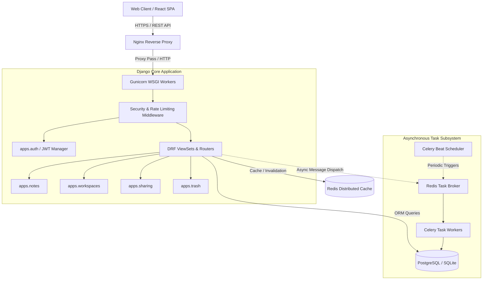

# Scriba Backend Engine

> RESTful API, asynchronous task queue, and data management layer powering Scriba.

[](https://scriba-notes.duckdns.org)
[](https://www.python.org/)
[](https://www.djangoproject.com/)
[](https://www.django-rest-framework.org/)
[](https://docs.celeryq.dev/)
[](https://redis.io/)

---

## Architectural Overview and Design Philosophy

The Scriba backend is built on Django 4.2 LTS and Django REST Framework (DRF), adhering strictly to enterprise-grade software engineering patterns. The platform is architected to balance academic software engineering rigor (decoupled domain models, transactional consistency, normalized relational schemas, test-driven guarantees) with industry production viability (horizontal scalability, asynchronous background queuing, rate limiting, and zero-trust JWT authentication).



---

## Academic Perspective: Systems and Theory

From a Computer Science and Software Engineering viewpoint, the system implements key theoretical concepts:

1. **Relational Normalization and Referential Integrity:**
   - Database entities are designed up to Third Normal Form (3NF) with explicit foreign keys, indexing on high-frequency query fields (`user_id`, `workspace_id`, `created_at`), and `on_delete` cascading constraints to preserve referential integrity.
2. **Stateless JWT Authentication Lifecycle:**
   - Implements cryptographically signed JSON Web Tokens (RFC 7519) using RSA/HMAC algorithms. Access tokens feature short TTLs (15 minutes), while Refresh Tokens are subject to rotation and a Redis-backed blacklisting registry to mitigate replay attacks.
3. **Decoupled Asynchronous Processing (Event-Driven Offloading):**
   - Workloads that violate synchronous HTTP SLAs (batch soft-deletion purges, token garbage collection, automated notification dispatch) are decoupled via Celery workers communicating over an in-memory Redis broker via the Redis transport protocol.
4. **Soft Deletion and Temporal Retention Lifecycle:**
   - Implements non-destructive deletion using a custom Model Manager (`TrashBin`). Deletion marks a record as soft-deleted and records `deleted_at`. Periodic Celery cron jobs execute threshold calculus (`now() - INTERVAL '30 days'`) to safely purge expired entities.

---

## Engineering and Production Highlights

From an engineering hiring perspective, this codebase showcases patterns expected in high-velocity tech teams:

- **Strict Separation of Concerns:** Organized into modular Django applications (`apps.auth`, `apps.notes`, `apps.workspaces`, `apps.sharing`, `apps.trash`), each responsible for its own domain models, serializers, permissions, and viewsets.
- **Defensive API Hardening:**
  - Granular Object-Level Permissions (`IsNoteOwner`, `HasWorkspaceAccess`).
  - IP-based sliding window rate-limiting at both Nginx and DRF throttles (`100 req/s` general, `10 req/s` for authentication).
  - Strict Cross-Origin Resource Sharing (CORS) and Content Security Policies.
- **Automated Testing and Coverage:** Comprehensive test harness using `pytest`, `pytest-django`, `factory-boy`, and `faker` ensuring high test coverage, deterministic test databases, and regression prevention.
- **OpenAPI 3.0 Documentation:** Automated schema generation via `drf-spectacular` providing interactive Swagger UI (`/api/docs/`) and Redoc (`/api/redoc/`) interfaces.
- **Containerized Deployment:** Multi-container production deployment with Docker Compose, Gunicorn WSGI (`gthread` worker types), and automated health checks.

---

## Domain Module Architecture

```
backend/
├── apps/
│   ├── auth/              # Custom user authentication, JWT lifecycle, OAuth providers
│   │   ├── models.py      # CustomUser, PasswordResetToken
│   │   ├── serializers.py # User registration, login, profile, password reset
│   │   ├── urls.py        # /api/v1/auth/ endpoints
│   │   └── views.py       # AuthViewSet, CustomTokenObtainPairView, CustomTokenRefreshView
│   ├── notes/             # Core note creation, tagging, pinning, and searching
│   │   ├── models.py      # Note, NoteVersion, Tag, MediaAttachment, WorkspaceActivity
│   │   ├── serializers.py # NoteListSerializer, NoteDetailSerializer, NoteCreateUpdateSerializer
│   │   ├── urls.py        # /api/v1/notes/ endpoints
│   │   └── views.py       # NoteViewSet (CRUD, filtering, search, versioning)
│   ├── workspaces/        # Multi-workspace grouping and collaboration
│   │   ├── models.py      # Workspace, WorkspaceMember, WorkspaceInvitation
│   │   ├── serializers.py # WorkspaceSerializer, WorkspaceMemberSerializer
│   │   ├── urls.py        # /api/v1/workspaces/ endpoints
│   │   └── views.py       # WorkspaceViewSet
│   ├── sharing/           # Granular public and private sharing links
│   │   ├── models.py      # NoteShare, WorkspaceShare (VIEWER / EDITOR)
│   │   ├── serializers.py # NoteShareSerializer, WorkspaceShareSerializer
│   │   ├── urls.py        # /api/v1/note-shares/, /api/v1/workspace-shares/
│   │   └── views.py       # NoteShareViewSet, WorkspaceShareViewSet, OAuthProviderViewSet
│   └── trash/             # Soft-delete lifecycle management
│       ├── models.py      # TrashBin entity with original workspace tracking
│       ├── serializers.py # TrashBinSerializer
│       ├── urls.py        # /api/v1/trash/ endpoints
│       └── views.py       # TrashViewSet (list, restore, empty)
├── config/
│   ├── celery.py          # Celery worker configuration and periodic beat schedules
│   ├── settings.py        # 12-Factor compliant settings via django-environ
│   ├── tasks.py           # Background tasks (cleanup_expired_trash, send_email_verification)
│   ├── urls.py            # Global routing table, OpenAPI schema, and health probe
│   └── wsgi.py            # Gunicorn entry point
├── tests/                 # Unit, integration, and performance test suites
├── Dockerfile             # Production container definition
└── requirements.txt       # Production dependency manifest
```

---

## API Specification Summary

The API is fully documented via OpenAPI 3.0 at `/api/docs/` and `/api/redoc/`. Key endpoint groups:

| Method | Endpoint | Description | Authentication |
| :--- | :--- | :--- | :--- |
| `POST` | `/api/v1/auth/register/` | Register a new user account | None |
| `POST` | `/api/v1/auth/login/` | Authenticate user and receive JWT tokens | None |
| `POST` | `/api/v1/auth/logout/` | Blacklist refresh token and invalidate session | Bearer Token |
| `GET` | `/api/v1/auth/me/` | Retrieve current authenticated user profile | Bearer Token |
| `POST` | `/api/v1/auth/forgot-password/` | Request password reset token | None |
| `POST` | `/api/v1/auth/reset-password/` | Confirm password reset with token | None |
| `POST` | `/api/v1/auth/token/refresh/` | Rotate expired access token | Refresh Token |
| `GET`, `POST` | `/api/v1/notes/` | List notes (with search and tag filters) or create a note | Bearer Token |
| `GET`, `PUT`, `DELETE` | `/api/v1/notes/{id}/` | Retrieve, update (or autosave), or soft-delete a note | Bearer Token |
| `GET`, `POST` | `/api/v1/workspaces/` | List or create workspaces | Bearer Token |
| `GET`, `POST` | `/api/v1/note-shares/` | List or create granular note sharing permissions | Bearer Token |
| `GET` | `/api/v1/trash/` | List recoverable soft-deleted notes | Bearer Token |
| `POST` | `/api/v1/trash/{id}/restore/` | Restore a soft-deleted note to its workspace | Bearer Token |
| `POST` | `/api/v1/trash/empty/` | Permanently purge all notes in trash | Bearer Token |
| `GET` | `/api/health/` | Service liveness probe | None |

---

## Local Development and Setup

### 1. Prerequisites
- Python 3.10+
- PostgreSQL or SQLite
- Redis (running locally or in Docker)

### 2. Environment Setup
```bash
# Clone and enter the backend directory
cd backend

# Create and activate virtual environment
python -m venv venv
source venv/bin/activate  # Windows: venv\Scripts\activate

# Install required dependencies
pip install -r requirements.txt

# Configure environment variables
cp .env.example .env
```

### 3. Database Migrations
```bash
python manage.py migrate
python manage.py createsuperuser
```

### 4. Running the Development Server
```bash
# Start Django development server
python manage.py runserver

# In a separate terminal, launch Celery worker
celery -A config worker -l info

# In a separate terminal, launch Celery Beat (Periodic tasks)
celery -A config beat -l info
```

---

## Testing and Code Quality

The backend maintains strict test coverage and formatting standards:

```bash
# Run automated test suite with coverage report
pytest --cov=apps --cov-report=term-missing

# Run code linter
flake8 apps config

# Check code formatting
black --check apps config
isort --check-only apps config
```
