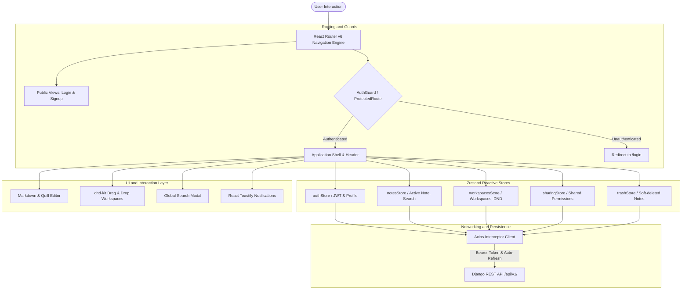

# Scriba Frontend Client

> Reactive Single Page Application (SPA) designed for writing and workspace organization.

[](https://scriba-notes.duckdns.org)
[](https://react.dev/)
[](https://tailwindcss.com/)
[](https://github.com/pmndrs/zustand)
[](https://axios-http.com/)
[](https://dndkit.com/)

---

## Architecture and Component Design

The Scriba user interface is developed as a modern React 18 Single Page Application, designed for high responsiveness, distraction-free writing, and collaborative interactions. The client leverages a unidirectional reactive data flow, atomic component modularity, and an optimized bundle delivery pipeline.



---

## Academic Perspective: HCI and Frontend Engineering Principles

From a Human-Computer Interaction (HCI) and Computer Science perspective:

1. **Cognitive Load Minimization:**
   - Implements Hick's Law and Fitts's Law in navigation layouts. High-frequency actions (creating notes, searching, workspace switching) require minimal click depth, utilizing subtle micro-animations and dark-mode glassmorphic contrast to reduce visual fatigue during prolonged writing sessions.
2. **Reactive State vs. Monolithic Contexts:**
   - Instead of monolithic Context providers or high-overhead Redux reducers, state is decomposed into decoupled Zustand stores (`authStore`, `notesStore`, `workspacesStore`, `sharingStore`, `trashStore`). Zustand's selector-based subscription model prevents unnecessary virtual DOM re-renders, guaranteeing smooth 60 fps interactions.
3. **Optimistic UI and Non-Blocking Updates:**
   - Notes, pin statuses, and workspace sorting reflect state changes optimistically in the UI before network completion, falling back gracefully and rolling back state upon asynchronous network error notification.
4. **Accessible Drag-and-Drop Algorithms:**
   - Integrated with `@dnd-kit` utilizing collision detection algorithms (`closestCenter`) and keyboard accessibility modifiers to allow reordering of notes and workspaces across varied input modalities.

---

## Engineering and Production Highlights

From a technical hiring viewpoint, this application demonstrates practical engineering standards:

- **Automated JWT Interceptor Lifecycle:**
  - `axios` instance configured with response interceptors that listen for `401 Unauthorized` errors. When detected, the interceptor halts failed requests, requests a fresh access token using the refresh token, and seamlessly replays the original requests without disrupting the user session.
- **Production Bundle Optimization:**
  - Automated Webpack tree-shaking and asset minification via the Create React App build pipeline, resulting in lean gzipped bundles (~128 KB JS, ~9.5 KB CSS) for sub-second Initial Server Response (TTFB) and Largest Contentful Paint (LCP).
- **Responsive Layout Design:**
  - Tailored with mobile-first Tailwind CSS utility tokens, supporting full responsiveness from mobile viewports (375px) up to ultra-wide displays (1440px+).
- **Design System Consistency:**
  - Dark theme aesthetics featuring custom radial backdrop glows, tailored amber accent palettes, and accessible contrast ratios conforming to WCAG AA guidelines.

---

## Source Directory Structure

```
frontend/
├── public/                # Static public assets, manifest, and icons
│   ├── favicon.ico        # Multi-resolution brand icon (16x16 to 64x64)
│   ├── favicon-32x32.png  # High-DPI browser favicon
│   ├── logo192.png        # Mobile WebApp / PWA icon
│   ├── logo512.png        # High-res PWA splash icon
│   ├── index.html         # SPA HTML template
│   └── manifest.json      # Web app manifest metadata
├── src/
│   ├── assets/            # Brand assets and vectors
│   │   └── logo.png       # Master Scriba logo
│   ├── components/        # Reusable presentation and interaction components
│   │   ├── AddButton.js        # Global floating creation button
│   │   ├── ConfirmationModal.js# Accessible confirmation modal dialogs
│   │   ├── ErrorBoundary.js    # React Error Boundary crash protection
│   │   ├── Header.js           # Top navigation, workspace switcher, and profile
│   │   ├── ListItem.js         # Sortable note preview card
│   │   ├── Loading.js          # Skeleton and spinner states
│   │   ├── SearchModal.js      # Global quick-search dialog
│   │   └── ShareModal.js       # Granular viewer/editor link generator
│   ├── pages/             # Route-level container components
│   │   ├── ForgotPasswordPage.js # Password reset request
│   │   ├── LoginPage.js          # Authentication and credentials view
│   │   ├── NotePage.js           # Dedicated markdown and rich-text editor
│   │   ├── NotesListPage.js      # Workspace notes gallery and filtering
│   │   ├── ProfilePage.js        # User account management
│   │   ├── ResetPasswordPage.js  # Password reset confirmation
│   │   ├── SettingsPage.js       # User preferences and application settings
│   │   ├── SharedNotesPage.js    # Collaboration hub for incoming notes
│   │   ├── SignupPage.js         # New account onboarding
│   │   ├── TrashPage.js          # Soft-deleted notes recovery center
│   │   ├── WorkspaceDetailPage.js# Individual workspace management
│   │   └── WorkspacesPage.js     # Multi-workspace manager with drag-and-drop
│   ├── services/          # HTTP communication and API clients
│   │   └── api.js              # Axios client with automatic token refreshing
│   ├── stores/            # Zustand reactive state stores
│   │   ├── authStore.js        # Authentication state, login/logout, tokens
│   │   ├── notesStore.js       # Active notes, filtering, search query state
│   │   ├── sharingStore.js     # Shared note permissions and access control
│   │   ├── trashStore.js       # Soft-deleted items and restore operations
│   │   └── workspacesStore.js  # Workspaces state and sorting order
│   ├── App.css            # Custom CSS animations and Tailwind layer extensions
│   ├── App.js             # Root route definitions and ToastContainer
│   └── index.js           # React 18 DOM mount point
├── package.json           # Dependencies and build scripts
└── tailwind.config.js     # Color palette, tokens, and plugins
```

---

## Local Development and Setup

### 1. Prerequisites
- Node.js 16.x or 18.x
- npm or yarn

### 2. Installation
```bash
# Navigate to the frontend directory
cd frontend

# Install dependencies
npm install
```

### 3. Environment Configuration
Create a `.env` file in the `frontend/` directory (or use `.env.development`):
```env
# Points to local Django backend during development
REACT_APP_API_URL=http://localhost:8000/api
```

### 4. Running the Development Server
```bash
npm start
```
The React development server will start at `http://localhost:3000` with hot-module reloading enabled.

---

## Production Build

To compile the production-ready, minified bundle:

```bash
npm run build
```
This generates an optimized `build/` directory ready for deployment to any static host, CDN, or Nginx web server.
